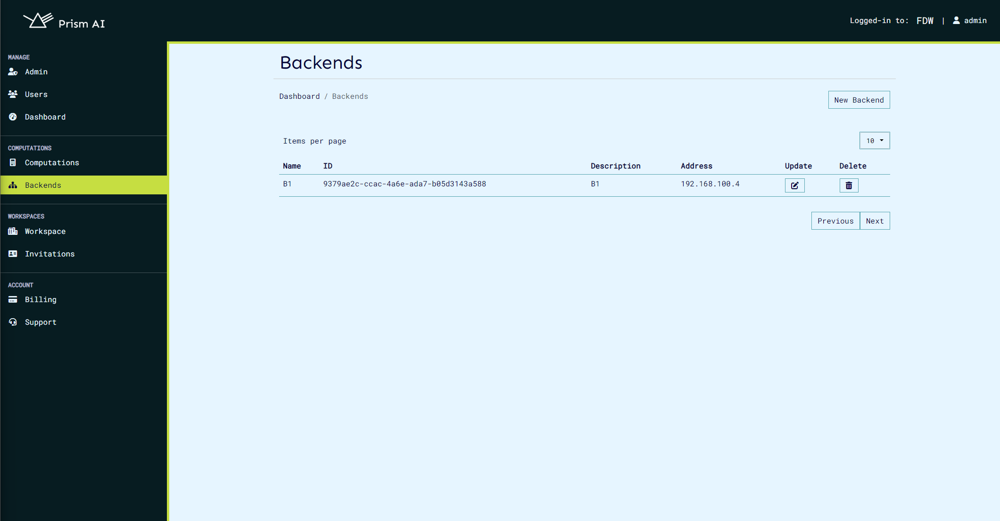
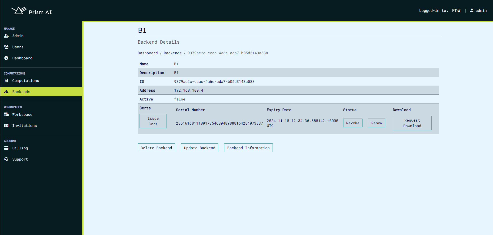
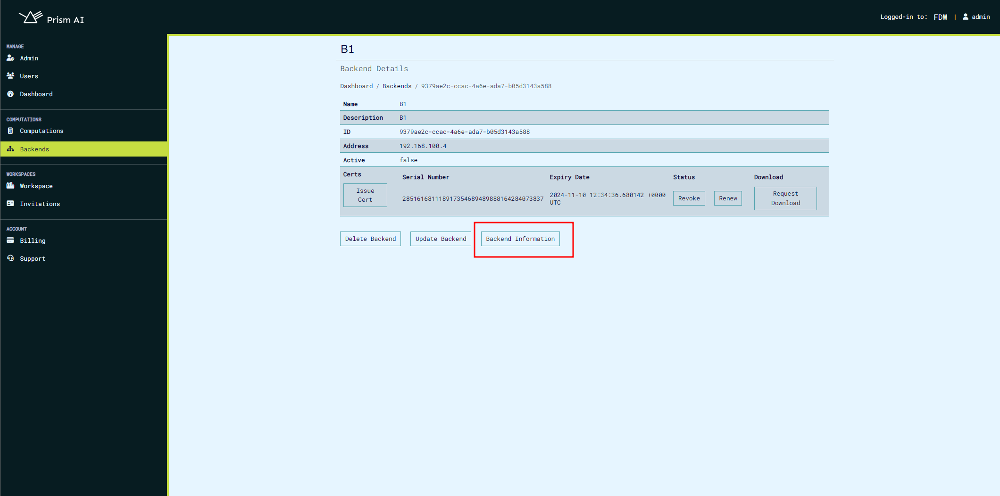
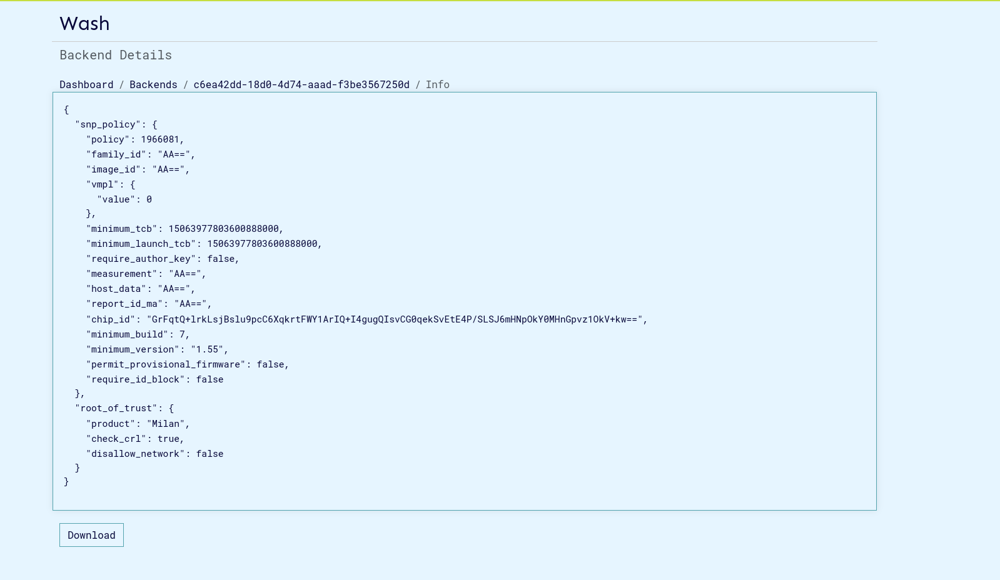
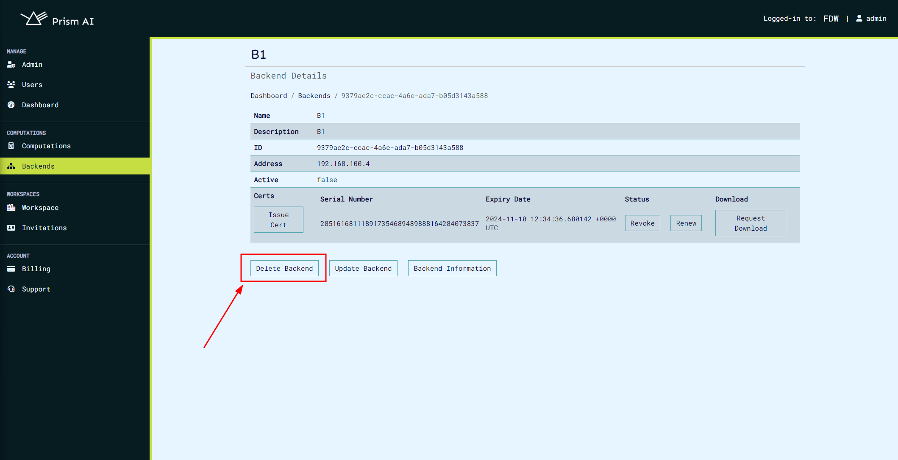
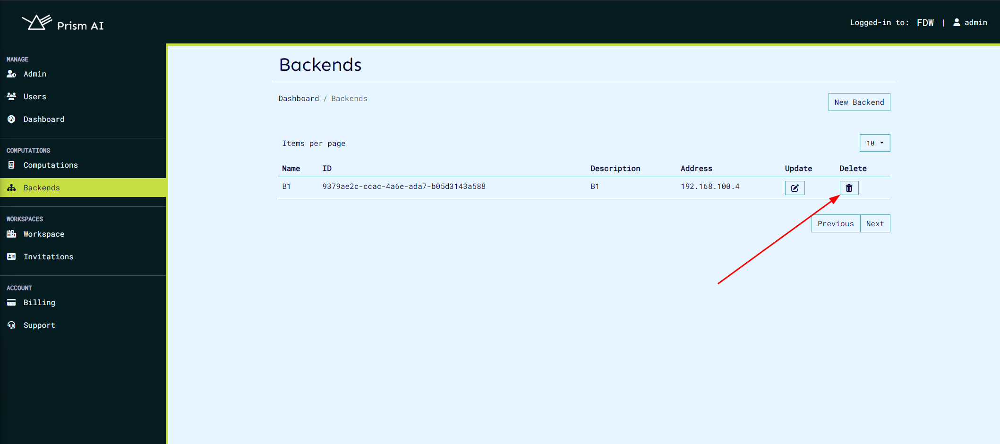

# Backends Service
The backends service provides a means to manage backends which is where computations run. The service allows the creation, update, viewing and deletion of a backend. The service also manages connections to different backends and monitors them as well as securing the connection with mutual TLS. The service also enables the termination of the manager service running on the backend.

A backend can be described as consisting on manager running on the host, along with agent in a virtual machine in a Trusted Execution Environment.


## Creating a Backend
This can be done on the user interface as below:


or by running:
```bash
curl -sSiX POST https://prism.ultraviolet.rs/backends -H "Content-Type: application/json" -H "Authorization: Bearer <user_token>" -d @- << EOF
{
  "name": "my dell server",
  "description": "",
  "address": "192.168.100.4"
}
EOF
```

response:

```bash
HTTP/1.1 201 Created
Content-Type: application/json
Location: /backends/fde3263e-70b8-4ce9-9f3c-4a203a0dcdf5
Date: Thu, 02 May 2024 10:15:35 GMT
Content-Length: 0
```

## Updating backend
This can be done on the user interface:


or on curl:
```bash
curl -sSiX PUT https://prism.ultraviolet.rs/backends/<backend_id> -H "Content-Type: application/json" -H "Authorization: Bearer <user_token>" -d @- << EOF
{
  "name": "my dell server",
  "description": "new description",
  "address": "192.168.100.4"
}
EOF
```

response:
```bash
HTTP/1.1 200 OK
Content-Type: application/json
Date: Fri, 03 May 2024 20:14:22 GMT
Content-Length: 0
```

## Listing Backends
List of backends is viewable on the ui:



This can be done on curl as shown below:

```bash
curl -sSiX GET https://prism.ultraviolet.rs/backends -H "Authorization: Bearer <user_token>"
```

response:

```bash
HTTP/1.1 200 OK
Content-Type: application/json
Date: Fri, 03 May 2024 20:17:03 GMT
Content-Length: 165

{"total":1,"limit":10,"backends":[{"id":"ca219243-0dd4-4e6e-94ad-54fbf3dd8b32","name":"my dell server","description":"some description","address":"192.168.100.4"}]}
```

## View Backend
An individual backend can be viewed on ui where it's details such as address, status, ID, certs and information can be acquired. Certs management is also carried out on this page.



This can be done on curl as below:

```bash
curl -sSiX GET https://prism.ultraviolet.rs/backends/<backend_id> -H "Authorization: Bearer <user_token>"
```

response:

```bash
HTTP/1.1 200 OK
Content-Type: application/json
Date: Fri, 03 May 2024 20:19:14 GMT
Content-Length: 129

{"id":"ca219243-0dd4-4e6e-94ad-54fbf3dd8b32","name":"my dell server","description":"some description","address":"192.168.100.4"}
```

## View Backend Information
For a SEV enabled backend, the backend information can be viewed using prism. This information is measured by a rust script found [here](https://github.com/ultravioletrs/cocos/blob/main/scripts/backend_info/src/main.rs). Once compiled and the binary is stored in `/build`, the backend information can be measured by prism as shown below.

On the backend page, click the Backend Information button:


If the measurement binary is absent and no measurement is found, an empty measurement file is displayed:


If the measurement is present or measurement is found in the db, the measurement file will be available for download.



The backend_info.json file is useful in cocos for [attested TLS](https://docs.cocos.ultraviolet.rs/attestation/#attested-tls), and can be used to verify [attestation report](https://docs.cocos.ultraviolet.rs/cli/#fetch-and-validate-attestation-report). The file is provided to [cocos-cli](https://docs.cocos.ultraviolet.rs/cli/#backend-info) which can add measurement data or host data. The file contains the SnpPolicy and RootOfTrust as shown:

```
{
  "snp_policy": {},
  "root_of_trust": {}
}
```

## Terminate Backend
This is used to disconnect and close the associated backend connection. This is usually triggered when a certificate is revoked while the backend is connected using this certificate or user initiated for any reason.
Please note that this action will stop all ongoing computations and stop manager and any running agent.

Manual backend termination can not be done directly on ui, but can be done using the curl command below:

```bash
curl -sSiX GET https://prism.ultraviolet.rs/backends/terminate/<backend_id>/<termination_type> -H "Authorization: Bearer <user_token>"
```

Termination trype is an integer:
- 0 - Certificate revokation
- 1 - User initiated termination

response:
```bash
HTTP/1.1 204 No Content
Content-Type: application/json
Date: Fri, 03 May 2024 20:41:29 GMT
```

On manager the logs will be as follows:
```bash
{"time":"2024-05-03T23:41:29.664410497+03:00","level":"ERROR","msg":"manager service terminated: server requested client termination\nBackend Closed"}
{"time":"2024-05-03T23:41:29.671347637+03:00","level":"ERROR","msg":"Error shutting down tracer provider: context canceled"}
```

## Delete Backend
This removes the backend from the database. This can be done by clicking the delete button on the backend's page as shown:



Alternatively, the backend can be deleted on the list backends page by clicking the trash icon:


This can be done on curl as shown below:

```bash
curl -sSiX DELETE https://prism.ultraviolet.rs/backends/<backend_id> -H "Authorization: Bearer <user_token>"
```

Response:
```bash
HTTP/1.1 204 No Content
Content-Type: application/json
Date: Fri, 03 May 2024 20:46:09 GMT
```
