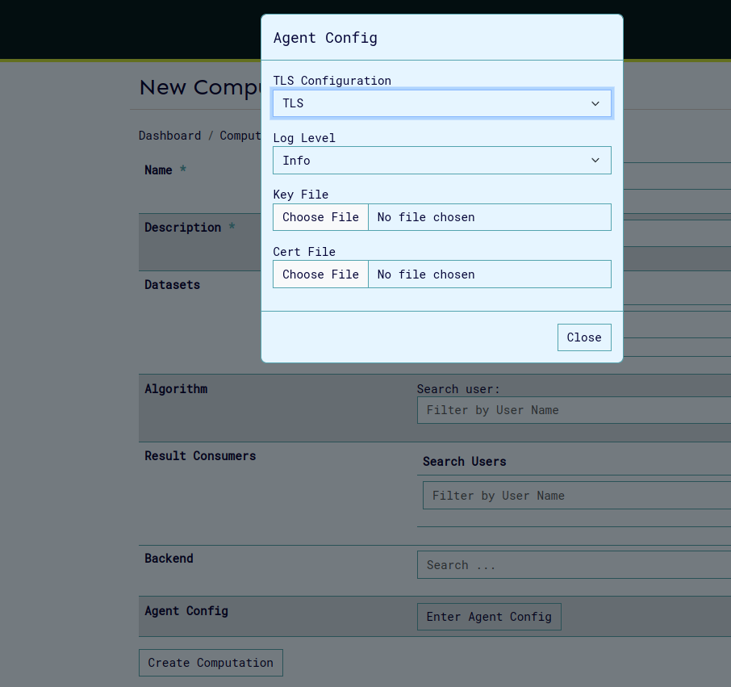
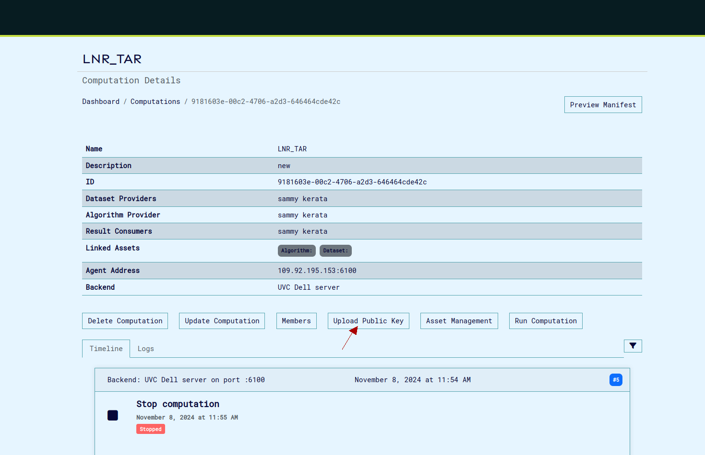
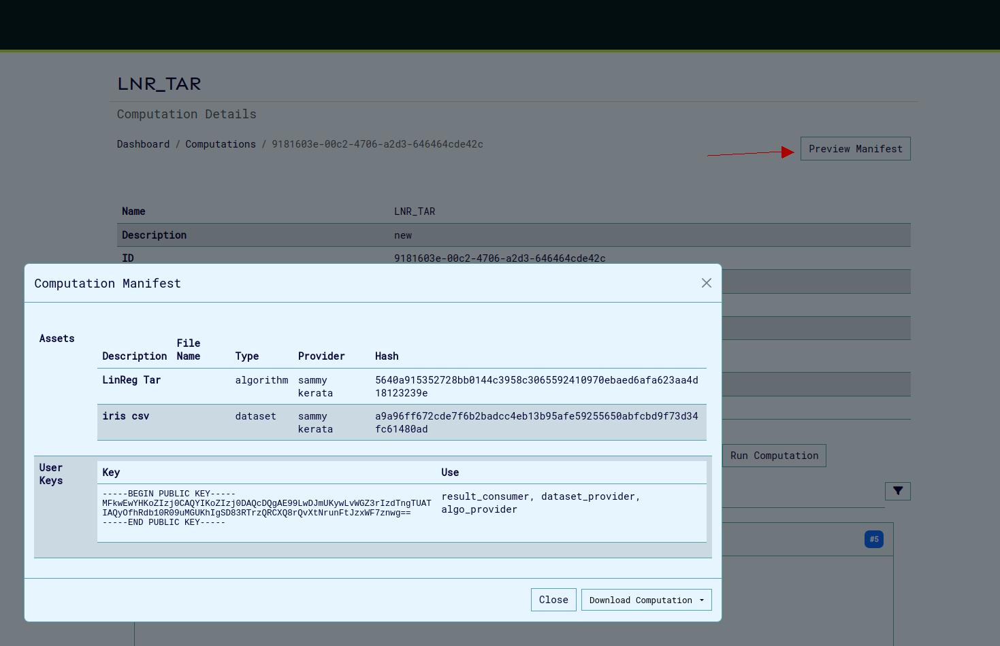

# Computations

The computations service provides a means to manage computations, with functions such as computation creation, update, deletion, and running.

## Add Computation

In order to create computation, we can to provide the following content:

```bash
curl -sSiX POST https://prism.ultraviolet.rs/computations -H "Content-Type: application/json" -H "Authorization: Bearer <user_token>" -d @- << EOF
{
  "name": "<name>",
  "description": "<description>",
  "backend_id": <backend_id"
  ]
}
EOF
```

On the ui this can be done on this page as shown here


Example:

```bash
curl -sSiX POST https://prism.ultraviolet.rs/computations -H "Content-Type: application/json" -H "Authorization: Bearer <user_token>" -d @- << EOF
{
  "name": "Machine Diagnostics Analysis",
  "description": "Performing diagnostics analysis on machine data",
  "backend_id": "fde3263e-70b8-4ce9-9f3c-4a203a0dcdf5",
  "agent_config": {
    "log_level": "debug"
  }
}
EOF
```

Response:

```bash
HTTP/1.1 201 Created
Content-Type: application/json
Location: /computations/240be921-5758-4ffa-9ed3-97e6e72e97ea
Date: Thu, 02 May 2024 14:29:22 GMT
Content-Length: 0
```

### Agent Configuration

The Agent Config feature allows users to configure TLS (Transport Layer Security) settings and logging levels for computational agents. This configuration is accessible through the Agent Config modal in the New Computation interface.

#### TLS Configuration Options

The system supports four TLS configuration modes:

1. Attested TLS

    - Basic TLS configuration with attestation verification during the TLS handshake.
    - No additional certificate or key files required.
    - Suitable for environments requiring basic secure communication.

2. Mutual TLS

    - Requires bi-directional authentication
    - Required files:
        - Key File
        - Certificate File
        - Server CA File
        - Client CA File
    - Provides highest level of security with mutual authentication

3. TLS

    - Standard TLS configuration
    - Required files:
        - Key File
        - Certificate File
    - Suitable for environments requiring encrypted communication without mutual authentication

4. No TLS

    - Disables TLS security
    - No additional configuration required
    - Should only be used in secure, isolated environments
    - Not recommended for production deployments

#### Log Level Configuration

- **Info**: Standard logging level for general operational information
  - Logs important events and milestones
  - Recommended for normal operation
  - Provides good balance of information without excessive detail

- **Debug**: Detailed logging for troubleshooting
  - Includes extensive operation details
  - Useful during development and debugging
  - May impact performance

- **Warn**: Warning-level messages only
  - Logs potentially harmful situations
  - Does not log normal operational information
  - Useful for monitoring potential issues

- **Error**: Critical issues only
  - Logs only error conditions
  - May miss important operational information

##### Best practices for log levels

- Use Info for normal operations
- Enable Debug temporarily for troubleshooting
- Use Error only when minimal logging is required

#### File Requirements

##### Key File

- Required for: Mutual TLS, TLS
- Format: PEM-encoded private key
- Purpose: Authentication of the agent

##### Certificate File

- Required for: Mutual TLS, TLS
- Format: PEM-encoded certificate
- Purpose: Identity verification of the agent

##### Server CA File

- Required for: Mutual TLS only
- Format: PEM-encoded CA certificate
- Purpose: Verification of server certificates

##### Client CA File

- Required for: Mutual TLS only
- Format: PEM-encoded CA certificate
- Purpose: Verification of client certificates

#### Implementation Steps



1. Access the Agent Config modal through the "Enter Agent Config" button on create/update computation page.
2. Select appropriate TLS Configuration mode
3. Set desired Log Level based on operational requirements
4. For Mutual TLS or TLS modes:
    - Upload required certificate and key files
    - Verify file formats and permissions
5. Click "Close" to save configuration

#### Troubleshooting

Common issues and solutions:

##### Certificate Issues

- Verify certificate chain validity
- Check certificate expiration dates
- Ensure proper file permissions

##### Connection Problems

- Verify all required files are properly uploaded
- Check network connectivity
- Confirm firewall rules allow TLS traffic
- Restart the computation

##### Authentication Failures

- Verify certificate-key pairs match
- Check CA trust chain
- Confirm client/server certificate compatibility

## Retrieve Computations

In order to get all computations:

```bash
curl -sSiX GET https://prism.ultraviolet.rs/computations -H "Authorization: Bearer <user_token>"
```

Example:

```bash
curl -sSiX GET https://prism.ultraviolet.rs/computations -H "Authorization: Bearer <user_token>"
```

Response:

```bash
HTTP/2 200
content-type: application/json
date: Mon, 27 May 2024 11:37:50 GMT
x-frame-options: DENY
x-xss-protection: 1; mode=block
content-length: 433

{"computations":[{"id":"f025d311-193a-469b-b504-f137e0b768c2","name":"name 1","status":"executable","owner":"e20aaa5a-95d7-444a-8471-51c67082adbf","start_time":"2024-05-27T11:36:42.99242Z","end_time":"0001-01-01T00:00:00Z","algorithm":{},"agent_config":{"log_level":"","cert_file":"","server_key":"","server_ca_file":"","client_ca_file":"","attested_tls":false},"agent_port":"","backend_id":"cbaf711f-a086-48e0-bea1-a53a9650ba9c"}]}
```

On the UI the listed computations appear so:


## Retrieve Computation Information

In order to get one specific computation, by ID:

```bash
curl -sSiX GET https://prism.ultraviolet.rs/computations/<computation_id> -H "Authorization: Bearer <user_token>"
```

Example:

```bash
curl -sSiX GET https://prism.ultraviolet.rs/computations/f025d311-193a-469b-b504-f137e0b768c2 -H "Authorization: Bearer <user_token>"
```

Response:

```bash
HTTP/2 200
content-type: application/json
date: Mon, 27 May 2024 11:39:22 GMT
x-frame-options: DENY
x-xss-protection: 1; mode=block
content-length: 414

{"id":"f025d311-193a-469b-b504-f137e0b768c2","name":"name 1","status":"executable","owner":"e20aaa5a-95d7-444a-8471-51c67082adbf","start_time":"2024-05-27T11:36:42.99242Z","end_time":"0001-01-01T00:00:00Z","algorithm":{},"agent_config":{"log_level":"","cert_file":"","server_key":"","server_ca_file":"","client_ca_file":"","attested_tls":false},"agent_port":"","backend_id":"cbaf711f-a086-48e0-bea1-a53a9650ba9c"}
```

The view computation page appears as below, it also contains buttons to edit, run, delete and view computation logs and events.


## Update Computations Information

In order to update computation:

```bash
curl -sSiX PUT https://prism.ultraviolet.rs/computations/<computation_id> -H "Content-Type: application/json" -H "Authorization: Bearer <user_token>" -d @- <<EOF
{
  "name": "[computation_name]",
  "description": "[computation_description]",
  "datasets": ["[dataset_1]", "[dataset_2]", "[dataset_3]"],
  "algorithm": ["[algorithm_1]", "[algorithm_2]", "[algorithm_3]"],
}
EOF
```

Example:

```bash
curl -sSiX PUT https://prism.ultraviolet.rs/computations/8b131663-058d-4e8f-8ccb-cc83c3f9e694 -H "Content-Type: application/json" -H "Authorization: Bearer <user_token>" -d @- <<EOF
{
  "name": "CNC Machine Diagnostics Analysis",
  "description": "Performing diagnostics analysis on CNC machine data",
  "result_consumers": [
    "3ed2a2ad-8251-484c-a39b-bdb82f122f67",
    "622d4b11-1b06-426e-baf6-e80d7025f961"
  ]
}
EOF
```

Response:

```bash
HTTP/2 200
content-type: application/json
date: Mon, 27 May 2024 11:51:25 GMT
x-frame-options: DENY
x-xss-protection: 1; mode=block
content-length: 0
```

The update computation page appears as below:


## Computation export and import

Prism allows users to export and import computations in both JSON and CSV formats. When exporting as JSON, all details of a computation are bundled into a single file, which can later be imported to recreate the computation with the provided data. Alternatively, multiple computations can be uploaded using a CSV file, which contains the relevant details for each computation. You can find a sample CSV file in the Prism repository [here](https://github.com/ultravioletrs/prism/blob/main/sample_computations.csv). When importing computations, ensure that all user IDs included in the file are valid and correspond to registered users in the workspace, including both backend and user IDs.

A sample computation that can be uploaded as json is shown:

```json
{
  "id": "185e61f4-2fd1-47c3-b8e7-1bf6a8466b79",
  "name": "sample_computation",
  "description": "sample",
  "owner": "f07b7716-2737-4228-9d80-d9df4ab5ee53",
  "start_time": "0001-01-01T00:00:00Z",
  "datasets": [
    {
      "provider": "f07b7716-2737-4228-9d80-d9df4ab5ee53",
      "hash": "171ae99ff0449d52cd37f824eec20f56d4efbe322e022e1df02a89eabc16209c"
    },
    {
      "provider": "f07b7716-2737-4228-9d80-d9df4ab5ee53",
      "hash": "3b8aea5a74d179a445e86ce23d2fc24c8cd65d34f19798cb8852a7bcf945b2ae"
    },
    {
      "provider": "f07b7716-2737-4228-9d80-d9df4ab5ee53",
      "hash": "64a6eb1ed400d9b8139d64ef21641e0a930cda8008e21d2b055f1ae91a2c710a"
    }
  ],
  "algorithm": {
    "provider": "f07b7716-2737-4228-9d80-d9df4ab5ee53",
    "hash": "9567a45920974a3261f9e897b3da7e49a391728f607f36f0ad6e8f5ec8a2041b"
  },
  "result_consumers": ["f07b7716-2737-4228-9d80-d9df4ab5ee53"],
  "agent_config": {
    "log_level": "debug",
    "cert_file": "",
    "server_key": "",
    "server_ca_file": "",
    "client_ca_file": "",
    "attested_tls": false
  },
  "backend_id": "9a8d67b6-9298-4393-81c6-8b7958a8cebf"
}
```

Upload of computations can be done on the computations page, the files accepted are json and csv.


Any computation can be downloaded by clicking the download button when you view the desired computation.


## Run Computation

In order to get one specific computation, by ID:

```bash
curl -sSiX POST https://prism.ultraviolet.rs/computations/<computation_id>/run -H "Content-Type: application/json" -H "Authorization: Bearer <user_token>"
```

Example:

```bash
curl -sSiX POST https://prism.ultraviolet.rs/computations/8b131663-058d-4e8f-8ccb-cc83c3f9e694/run -H "Content-Type: application/json" -H "Authorization: Bearer <user_token>"
```

Response:

```bash
HTTP/1.1 200 OK
Content-Type: application/json
Date: Fri, 03 May 2024 08:37:24 GMT
Content-Length: 0
```

## Remove a Computation

In order to delete computation:

```bash
curl -sSiX DELETE "https://prism.ultraviolet.rs/computations/<computation_id>" -H "Authorization: Bearer <user_token>"
```

Example:

```bash
curl -sSiX DELETE "https://prism.ultraviolet.rs/computations/8b131663-058d-4e8f-8ccb-cc83c3f9e694" -H "Authorization: Bearer <user_token>"
```

Response:

```bash
HTTP/1.1 204 No Content
Content-Type: application/json
Date: Thu, 10 Aug 2023 07:34:17 GMT
X-Frame-Options: DENY
X-Xss-Protection: 1; mode=block
```

## User Keys

Cocos implements a public-key cryptography system for user authentication and role management in its multiparty confidential computing platform. Each user requires only a single public-private key pair per computation, regardless of how many roles they hold in that computation. Private keys are used for [command-line  operations](https://docs.cocos.ultraviolet.rs/cli/).

Cocos supports three types of cryptographic keys:

- RSA
- ECDSA
- Ed25519

### Key Usage Workflow

#### Registration Phase

- [User generates one public-private key pair](https://docs.cocos.ultraviolet.rs/cli/#generate-keys)
- User provides their public key when being assigned to the computation

- System associates the public key with all of the user's designated roles

#### Operation Phase

Users use the same private key for all CLI operations, regardless of role:

- [Algorithm uploads](https://docs.cocos.ultraviolet.rs/cli/#upload-algorithm)
- [Data uploads](https://docs.cocos.ultraviolet.rs/cli/#upload-dataset)
- [Result retrieval](https://docs.cocos.ultraviolet.rs/cli/#retrieve-result)

### Security Considerations

#### Private Key Handling

- Private keys should never be shared
- Private keys should be stored securely
- Private keys are only used locally with CLI operations
- One private key is sufficient for all roles in a computation

#### Public Key Distribution

- Public keys are safe to share and can be viewed in the manifest

- Public key must be registered once before participation
- Same public key is used for all roles in the computation

#### Best Practices

- Keep private keys secure and backed up
- Register public key once before beginning computation participation
- Verify all role assignments are associated with your single key pair by viewing the manifest
- Consider using separate key pairs for different workspaces and computations
